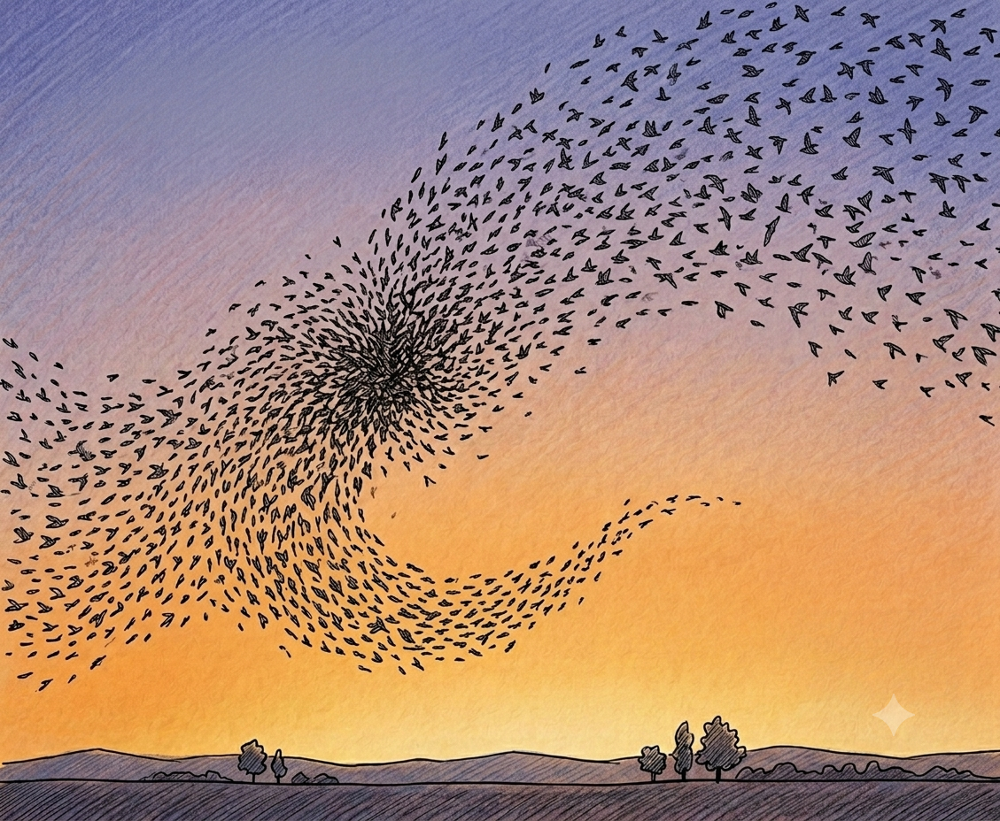

Many birds fly alongside one another, but some take group flying to an entirely different level.

Certain geese, for instance, form beautiful, regular V-shaped formations, as if they were performing in a fighter-jet airshow.

But even more impressively, some birds, such as starlings, form swarm-like flocks of thousands of individuals, flying at speeds of up to 50 km/h in what appears to be a dance that looks simultaneously harmonious and chaotic.

How do they do it without walkie-talkies or a ground control station? Surely it must be divine intervention — or telepathy!

{{}}

## Reynolds' Boids Model

Although biologists had been studying bird flocks and fish schools for years, a breakthrough in flock modeling came from a computer graphics researcher named C. W. Reynolds in 1987.

Curiously, Reynolds' [boids paper](https://dl.acm.org/doi/10.1145/37401.37406) does not contain a single equation. Is that a problem? Hell no, it's the perfect excuse to reverse engineer it!

### Kinematics

A flying bird (just like an airplane, a helicopter or a drone) is a rigid body moving in three dimensions. Its motion therefore has [six degrees of freedom](https://en.wikipedia.org/wiki/Six_degrees_of_freedom): three describing the position of its center of mass and three describing its orientation (or attitude).

Under smooth flight conditions, a bird's nose, much like that of an airplane, generally points in the direction of flight, i.e. along its velocity vector. There is usually little relative pitch or yaw during straight flight. Birds (and airplanes) do, however, roll when making a turn, accompanied by some pitch and yaw to achieve what is known as a coordinated turn.

For simplicity, we will neglect the bird's attitude and focus only on the motion of its center of mass.

The trajectory of any bird $i$ is governed by the basic kinematic equations:

$$
\begin{aligned}
\frac{\mathrm{d}\vec{r}_i}{\mathrm{d}t} = & \vec{v}_i \\
\frac{\mathrm{d}\vec{v}_i}{\mathrm{d}t} = & \vec{a}_i
\end{aligned}
$$

where $\vec{r}_i$, $\vec{v}_i$, and $\vec{a}_i$ denote, respectively, the position, velocity, and acceleration of bird $i$.

Reynolds' approach is based on three flock-specific steering rules: cohesion, alignment, and separation. Although Reynolds described these rules algorithmically rather than through equations, we can translate them into a simple mathematical model.

The net acceleration $\vec{a}_i$ is then the sum of the three components (or driving forces per unit mass, if you will):

$$
\vec{a}_i = \vec{a}_i^\mathrm{c} + \vec{a}_i^\mathrm{a} + \vec{a}_i^\mathrm{s}
$$

where the superscripts $\mathrm{c}$, $\mathrm{a}$, and $\mathrm{s}$ denote cohesion, alignment, and separation, respectively.

### Perception Zone

Birds' perception capabilities are limited: they have no X-ray vision, lidar, or even a foldable rear-view mirror. So, in practice, the motion of a given bird can only depend on a relatively small number of nearby flock mates.

Reynolds defined the perception zone geometrically: bird $i$ is influenced only by birds within a radial distance $R_{\mathrm{p}}$ and within a vision cone defined by a half-angle $\phi$ relative to its forward heading. Mathematically, the perception zone of bird $i$ is:

$$
\mathcal{P}_i =
\left\{
\vec{r} \in \mathbb{R}^3
\;\middle|\;
0 < \|\vec{r} - \vec{r}_i\| \leq R_{\mathrm{p}},
\quad
\frac{(\vec{r} - \vec{r}_i) \cdot \vec{v}_i}
{\|\vec{r} - \vec{r}_i\|\,\|\vec{v}_i\|}
\geq \cos \phi
\right\}
$$

and the set of birds inside it is:

$$ \mathcal{N}_i ​= \left\{j \ne i: \vec{r}_j \in \mathcal{P}_i \right\} $$

### Cohesion

Cohesion is the force that pulls a bird toward the geometric center of its local neighborhood:

$$
\vec{a}_i^\mathrm{c} = - K_{\mathrm{c}}
\left(\vec{r}_i - \langle \vec{r} \rangle _{i}  \right)
$$

with:

$$ \langle \vec{r} \rangle _{i} = \frac{1}{|\mathcal{N}_i|} \sum_{j \in \mathcal{N}_i} \vec{r_j} $$

where $K_{\mathrm{c}}$ is the cohesion parameter.

In terms of [PID controller](https://en.wikipedia.org/wiki/PID_controller) theory, if we define the position error as $e=(\vec{r}_i - \langle \vec{r} \rangle _{i})$, then the cohesion component is analogous to a P (proportional) term.

Cohesion encourages the formation of a flock from individual birds or the merger of smaller flocks, and is ultimately what keeps the flock from disintegrating.

### Alignment

Alignment is the force that drives a bird toward the average velocity of the birds in its perception zone:

$$
\vec{a}_i^\mathrm{a} = - K_{\mathrm{a}}
\left(\vec{v}_i - \langle \vec{v} \rangle _{i}  \right)
$$

with:

$$
\langle \vec{v} \rangle _{i} =
\frac{1}{|\mathcal{N}_i|} \sum_{j \in \mathcal{N}_i} \vec{v}_j
$$

where $K_{\mathrm{a}}$ is the alignment parameter.

In terms of PID controller theory, the alignment component is analogous to a D (derivative) term. This is not a coincidence: for a position-controlled system, velocity feedback is usually critical for damping the dynamics and preventing oscillations.

Alignment tends to make neighboring birds fly at similar speeds and along quasi-parallel trajectories. This helps maintain a stable cohesive state and, together with separation, reduces the risk of collisions.

### Separation

Separation is the repulsive force that keeps birds from getting too close to one another. From a mathematical standpoint, it is the least well-defined of the three behavioral rules. Here, we opt for a spring-like repulsion. Schematically, we imagine that each bird is at the center of a rubber balloon of radius $R_{\mathrm{s}}$; whenever the distance between any two birds is less than $2 R_{\mathrm{s}}$, a repulsive force proportional to the deformation of the balloon arises. Mathematically, this leads to:

$$
\vec{a}_{i}^\mathrm{s} = + K_{\mathrm{s}} \sum_{j \in \mathcal{N}_i}
\max (0, 2 R_{\mathrm{s}}  - d_{ij} ) \frac{\vec{r}_i - \vec{r}_j}{d_{ij}}
$$

where $d_{ij}=\|\vec{r}_i - \vec{r}_j\|$, and $K_{\mathrm{s}}$ is the separation parameter.

## Flying Solo

Reynolds' steering rules give birds the ability to fly in a group, implicitly assuming they can already fly solo. But that is no trivial thing!

How should they know where to go? How fast? How to avoid obstacles or predators?

Each of these steering behaviors requires a corresponding acceleration term.

A target flying trajectory and speed are fairly easy to implement; two P controllers on position and velocity will do the trick.

Obstacle avoidance is more challenging. Taken to the extreme, you are halfway into building an airplane autopilot. To keep things manageable, we need to simplify quite a bit.

The first step is to predict the expected position some time into the future:

$$ \vec{s}_i = \vec{r}_i + \tau \vec{v}_i$$

where $\tau$ is the prediction horizon (typically a few seconds).

We then evaluate whether this projected point $\vec{s}_i $ lies inside an obstacle $k$. If it does, we apply a repulsive force as we did to separate two birds. For example, if the obstacle is spherical with center $\vec{c}_k$ and radius $R_k$, we use:

$$
\vec{a}_{i}^\mathrm{o} = + K_{\mathrm{o}} \sum_{k}
\max (0,  R_k - d_{ik}) \frac{\vec{s}_i - \vec{c}_k}{d_{ik}}
$$

where $d_{ik}=\|\vec{s}_i - \vec{c}_k\|$, and $K_{\mathrm{o}}$ is the obstacle-avoidance parameter.

Time for birdwatching — let's put these rules to the test!

<canvas id="bird-flock"></canvas>

