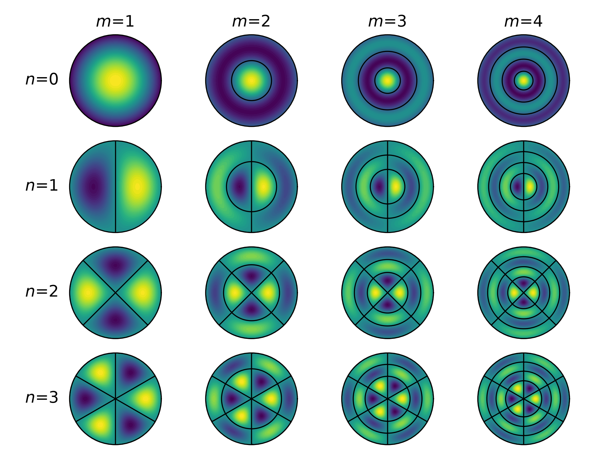

Knowing very little about music, acoustics, or wave mechanics, I couldn't help being impressed by this [Christmas Lectures video](https://www.youtube.com/watch?v=YlPTasQsPo8), especially the Chladni figures.

The urge to calculate those patterns was almost immediate. The problem was that, although I was already somewhat familiar with hyperbolic conservation equations, waves are a rather different beast. So I had to start from the very beginning.

The simplest wave model is the one-dimensional wave equation:

$$
\frac{\partial^2 u}{\partial t^2} =
c^2 \frac{\partial^2 u}{\partial x^2}  
$$

This equation describes, for example, the vibration of a guitar string, the propagation of seismic waves during an earthquake, or the pressure fluctuations that allow us to enjoy our favorite song.

{{}}

## A Chain of Springs and Masses

The first time you see it, the wave equation can look rather odd: a second-order time derivative on the left and something that looks deceptively like a diffusion term on the right. It turns out to be much simpler than it seems.

Consider a chain of $N$ point masses $m$ connected by identical springs with spring constant $k$.

If the position of each mass is written as:

$$ x_i = \hat{x}_i + u_i$$

where $\hat{x}_i$ denotes the equilibrium position and $u_i$ its displacement, then Newton's second law gives:

$$ m \frac{d^2 u_i}{d t^2} = F_i $$

where $F_i$ is the sum of the spring forces acting on mass $i$. Since each spring exerts a force proportional to its extension, we obtain:

$$ \frac{d^2 u_i}{d t^2} =
\frac{k}{m} \left(u_{i+1} - 2 u_i + u_{i-1} \right)$$

Re-expressing $k/m$ in terms of the macroscopic properties of the system — the total length $L = N \Delta x$, total mass $M = N m$, and effective stiffness of the whole chain $K = k/N$ — gives:

$$ \frac{d^2 u_i}{d t^2} =
\frac{K L^2}{M} 
\left( \frac{ u_{i+1} - 2 u_i + u_{i-1} }{\Delta x^2}  \right)
$$

Notice that the term in parentheses is the finite-difference approximation of the second spatial derivative. As the spacing between the masses tends to zero, this discrete system converges to the wave equation.

So the wave equation is simply Newton's second law applied locally. The restoring force is determined by the displacement relative to neighboring points, which leads naturally to the second spatial derivative.

The resulting system of second-order ordinary differential equations can be solved in several ways. A good choice is the [velocity Verlet](https://en.wikipedia.org/wiki/Verlet_integration) algorithm, because it explicitly updates the velocity $\dot{u}$ while exhibiting excellent long-term energy conservation. The time step must satisfy the Courant–Friedrichs–Lewy (CFL) condition, $\Delta t \le \Delta x / c$.

<canvas id="chain-spring-mass"></canvas>


Who would guess that springs and masses could be so mesmerizing?  

## A String

A very similar argument leads to the equation governing the transverse motion of a vibrating string. For small amplitudes, we once again obtain the one-dimensional wave equation:

$$
\frac{\partial^2 u}{\partial t^2} =
\frac{T}{\rho} \frac{\partial^2 u}{\partial x^2}
$$

where $u$ now denotes the transverse displacement of the string from its equilibrium position, $T$ is the string tension, and $\rho$ is the linear mass density.

Note the physical analogy between $KL/(M/L)$ for the spring-and-mass chain and $T/\rho$ for the string: in both cases the wave speed is determined by a restoring force divided by a linear mass density.

That's enough to generate waves, but not enough to play *The Four Seasons*. For that, we need at least two more ingredients.

The first ingredient is damping, after all, no string vibrates forever. Energy is lost in many ways, but let's assume it is proportional to the local velocity:

$$ f_{\mathrm{damping}} = - \gamma \rho \frac{\partial u}{\partial t} $$

where $\gamma$ is a frequency-independent loss coefficient.

The second ingredient is an excitation force, like a bow moving across the string. As the bow is drawn across the string, it alternately sticks to and slips over the string, producing an intermittent friction force that depends nonlinearly on their *relative* velocity $v_{\mathrm{rel}}(t)=v_{\mathrm{bow}}(t) - \dot{u}(t, x_{\mathrm{bow}})$. We can model it with a Stribeck-type expression:

$$
F_{\mathrm{bow}} = F_{\mathrm{N}} 
\left[ \mu_{\mathrm{d}} + (\mu_{\mathrm{s}} -  \mu_{\mathrm{d}})
e^{-|v_{\mathrm{rel}}|/v_{\mathrm{scale}}} \right]
\tanh \left( \frac{v_{\mathrm{rel}}}{\epsilon} \right)
$$

where $F_{\mathrm{N}}$ is the normal force applied by the player, $\mu_{\mathrm{d}}$ and $\mu_{\mathrm{s}}$ are the dynamic and static friction coefficients, and $v_{\mathrm{scale}}$ is a scaling velocity.

Since these two terms are just additional forces acting on the string, we add them to the right hand side of the wave equation, leading to:

$$
\frac{\partial^2 u}{\partial t^2} =
\frac{T}{\rho} \frac{\partial^2 u}{\partial x^2} -
\gamma \frac{\partial u}{\partial t} +
\frac{F_{\mathrm{bow}}}{\rho} \delta(x - x_{\mathrm{bow}})  
$$

That's it. You choose how you want to play it: *pizzicato* or *arco*!

<canvas id="violin-string"></canvas>


What happens as you pluck the string closer and closer to the ends?

## A Drumhead

The previous two examples have focussed on how waves evolve in time. But when talking about waves, there is an even more important and fundamental aspect to address: which waves are allowed to exist?

We could do this analysis for the violin string, but we like a good challenge, so let's do it for a drumhead. For a circular geometry, it's natural to express the wave equation in polar coordinates:

$$
\frac{\partial^2 u}{\partial t^2} =
c^2 \left(
\frac{\partial^2 u}{\partial r^2} +
\frac{1}{r}\frac{\partial u}{\partial r} +
\frac{1}{r^2}\frac{\partial^2 u}{\partial \theta^2}
\right)
$$

with the boundary condition that the membrane is fixed on the outer rim:

$$ u(r=R, \theta, t) = 0$$

Now we use the technique of separation of variables to express the transverse displacement of the drum membrane as the product of a spatial and a time component:

$$ u(r,\theta,t) = \phi(r,\theta) T(t) $$

This leads to an ordinary differential equation for $T(t)$:

$$ \ddot{T} + (c \lambda)^2 T = 0 $$

and an [eigenvalue equation](https://en.wikipedia.org/wiki/Helmholtz_equation) for the spatial part:

$$
\left(
\frac{\partial^2}{\partial r^2} +
\frac{1}{r}\frac{\partial}{\partial r} +
\frac{1}{r^2}\frac{\partial^2}{\partial \theta^2}
\right) \phi + \lambda^2 \phi = 0
$$

The solutions $\phi(r,\theta)$ describe the *shapes* of the drumhead's normal modes, while the $\lambda$ values (the eigenvalues) determine their *frequencies*.
This equation can be solved analytically, giving the spatial pattern for each mode:

$$
\phi_{n,m}(r,\theta) = J_n(j_{n,m} r/R)
\left[A \sin(n \theta) + B \cos(n \theta)\right]
$$

and the respective eigenvalue:

$$ \lambda_{n,m} = \frac{j_{n,m}}{R}$$

where $J_n$ is the $n$-th order Bessel function of the first kind, and $j_{n,m}$ denotes its $m$-th positive zero.

{{}}

The number of angular and radial nodal lines increases with $n$ and $m$, respectively, giving rise to increasingly complex vibration patterns and, in general, higher frequencies. Quantitatively, the angular frequency associated with each mode is:

$$ \omega_{n,m} = \frac{c j_{n,m}}{R}$$

The cool and remarkable thing is that when we strike the membrane in a given way, certain modes are preferentially excited. Therefore, the distribution of frequencies — and thus the sound we hear — depends on where and how we hit the drum.

The mathematical treatment of an arbitrary deformation is somewhat convoluted, but if we assume an idealized point-like displacement at the point $(r_\mathrm{s},\theta_\mathrm{s})$, a rather simple expression results:

$$
u(r,\theta,t) =
\sum_{n,m} C_{n,m}
J_n \left( j_{n,m} r / R \right)
\cos \bigl(n (\theta - \theta_\mathrm{s}) \bigr)
\cos \bigl(\omega_{n,m} t \bigr)
$$

with:

$$ C_{n,m} \propto J_n\left(j_{n,m} r_\mathrm{s} / R \right) $$

where $C_{n,m}$ is the excitation amplitude of mode $(n,m)$.

Enough math — grab the mallet and smash that drumhead!

<canvas id="drumhead-vibrations"></canvas>

